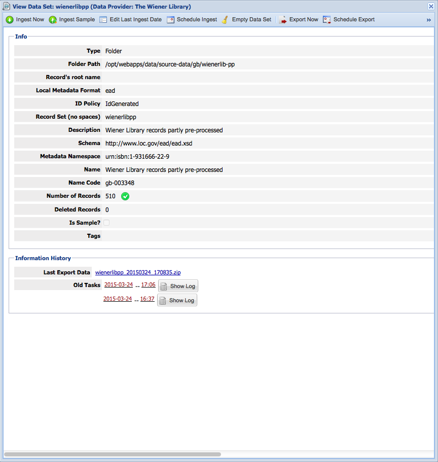

# Introduction

The [EHRI portal][portal] provides access to collection and item descriptions relating to the Holocaust from archives, libraries and museums from Europe and beyond.
These descriptions are either created and edited manually from the portal or provided in digital form and imported into the database that powers the portal.

Collection holding institutes (CHIs) who provide their descriptions to EHRI in digital are requested to do so in the [Encoded Archival Description (EAD)][ead] format following [EHRI's Guidelines for Description][ehri-guidelines], which are based on [ISAD(G)][isadg].
The preferred method of delivery of these files is [OAI-PMH][oai-pmh], a well-known protocol for harvesting metadata over the web.
OAI-PMH supports full and incremental collection of metadata records, notifications of deleted records and downloading specified sets of records. If implemented correctly, EHRI could download relevant EADs from CHIs and update the record in the database. However, this is where theory and practice diverge.


[portal]: https://portal.ehri-project.eu/
[ead]: http://www.loc.gov/ead/
[ehri-guidelines]: https://ehri.basecamphq.com/projects/7720758/file/191762349/DL15%205%20Exhibit%203%20D%2017%203%20Guidelines%20update%20July%202014.pdf
[isadg]: http://www.icacds.org.uk/eng/ISAD%28G%29.pdf
[oai-pmh]: http://www.openarchives.org/OAI/2.0/openarchivesprotocol.htm


Only a few CHIs were able to offer records via OAI-PMH and none do it in such a way that import is straightforward. Differences between the above ideal situation and reality include:

- there is no set that contains just the records that had been selected for EHRI. This means the records have to be filtered after the harvest, or individual records need to be retrieved.
- the OAI-PMH endpoint behaves in unexpected ways. One endpoint did not stop sending records after the set of records had been downloaded completely, but kept sending "there is more" and started to repeat records.
- the XML does not use XML Namespaces correctly, so that the actual metadata was not separable from the container XML specified by OAI-PMH.
- the EAD has content issues. In one example, descriptions of parts of a documentary unit were in separate records instead of being nested in an EAD hierarchy. In other cases, the EHRI (or ISAD(G)) guidelines were not followed and EHRI had to reorder metadata in the records.
- the importer that loads and inserts or updates the metadata from EAD files cannot handle some valid EAD elements. The current implementation of the EAD importer cannot import mixed content correctly, so text paragraphs with EAD markup elements do not import as expected.

## About this document

This document outlines the setup and use of open source components as a preprocessing tool chain to automate the ingest, preprocessing and import of EAD files from a single collection holding institute.
The next section will discuss the component that manages the ingest from OAI-PMH endpoints and folder. Section 3 will discuss the integration of various preprocessing components into a tool chain. Section 4 discusses the automated import of metadata records. Finally the last section will discuss some outstanding issues and limitations.

# Ingest

The PP starts at the ingest process. This is handled by the [REPOX][repox] software, that can ingest XML metadata from OAI-PMH endpoints, folders on the file system, HTTP endpoints and FTP servers. It can also act as an SRU Update endpoint to get updated records pushed to it.
REPOX is currently maintained by [Europeana][europeana], who use it in the infrastructure of [The European Library][tel] to harvest bibliographical metadata from national and research libraries around Europe.

[repox]: https://github.com/europeana/REPOX
[europeana]: http://www.europeana.eu/
[tel]: http://www.theeuropeanlibrary.org/

REPOX has a web interface and a REST interface to manage the (minimal) administrative information about data providers and mostly technical information about the data sets they provide.
REPOX can ingest records on demand, or following a schedule. Similarly, exporting the records to a folder on the file system can happen on demand or following a schedule.



# Preprocessing

EHRI has produced [various preprocessing tools][ead-pre] to normalise or even correct ingested records. These tools should be used before importing the data into the database using the importer tools, because the importer tools have requirements that not all records adhere to.

[ead-pre]: https://github.com/EHRI/ehri-ead-preprocessing

Metadata from specific CHIs need more preprocessing than from others. Some of these tools must be called in a certain order when used. Some tools are XSLT stylesheets, others are Java processors packaged as a JAR file.

This tool chain can be created by integration of these various tools. Rather than creating a new tool with the functionality of the tools needed for each CHI's records, integrating the existing tools requires configuring routes from ingest to import via the tools.

## Implementation

Software programmes and tools can be integrated by viewing their inputs and outputs as messages that are passed around. Common scenarios have been identified as [Enterprise Integration Patterns][eip]. Many of these patterns, if not all, are supported by the [Apache Camel][camel] framework. We chose to use the [Apache ServiceMix][servicemix] application (version 5.4.0) to dynamically deploy a proof of concept route from the REPOX ingest manager to the REST service for importing preprocessed EAD files.

[eip]: http://www.eaipatterns.com/toc.html
[camel]: http://camel.apache.org
[servicemix]: http://servicemix.apache.org

Apart from the basic installation of ServiceMix, the implementation depends on OSGi features `camel-saxon` and `camel-http`, which can be installed from within ServiceMix.

## Chained tools

The tool chain is file based, meaning the inputs and outputs of each step are files in the file system. Other exchange mechanisms are supported, such as message queues and shared databases, but for the purpose of this demonstration we tried to minimise the number of dependencies.

### Filter and unwrap

As REPOX manages records from various sources, including OAI-PMH, it outputs ("exports") all records in the set, including records that in OAI-PMH were marked as 'deleted'. All exported files are wrapped in a REPOX wrapper, but the deleted records should not be included in the processing steps. The files that do have EAD content need to have their REPOX wrapper removed, which is the filter step in the Camel route.

### Conversion of mixed content to Markdown equivalents

The EAD importer in the backend of the portal has a few limitations. The translator integration pattern is implemented here to make sure the incoming files are formatted in a way that the importer can use, while still being valid EAD. The limitation we are circumventing in this step is the lack of support for mixed content, such as:

```xml
<p>There is <emph render="italic">italics</emph> in my text.</p>
```

Three stylesheets translate this and similar markup to [Markdown][md] markup, which is how the portal interprets the text. Not all source records include all of the possibly problematic markup, and in future iterations the importer may correctly parse the mixed content. Depending on the source, these translator steps can be included or excluded from the preprocessing tool chain.

[md]: http://www.daringfireball.net/projects/markdown/

In the proof of concept, three XSLT stylesheets are used to convert `<emph>` within `<p>` to Markdown, convert `<extref>` to Markdown links and remove `<emph>` in `<persname>` to a concatenation of name parts.

### Storing preprocessed files in a repository

The final step before import is management of the processed files. In this PoC processed files are renamed and stored in directories based on the country and repository codes in the EAD files.

If the tool chain is used again with updated files, the EAD structure in the new processed files could be compared to that in the existing files to see if structural changes occurred. Changes in the structure of an archival fonds, especially if some units get different identifiers, are not supported by the import process. Content updates of existing documentary units are supported.

# Import

The [EHRI portal backend][ehri-rest] allows calling an HTTP endpoint to start an import process. A call to this endpoint requires a number of parameters: the scope of the imported unit description(s), i.e. the identifier of the repository; a log message about the import, which the import guidelines require to include the source and date of ingest; and a properties file that specifies the mapping of EAD fields to description fields defined by the EHRI guidelines.

[ehri-rest]: https://github.com/EHRI/ehri-rest

The PoC defines hardcoded constant values for each of these parameters, but it is possible to use a registry of source datasets and accompanying values to dynamically find the correct values for each input.

In this PoC, the end of the tool chain is this endpoint that accepts a single EAD file as the body of a `POST` request. As each import creates an import event in the database, using this endpoint creates some overhead. To prevent overloading the server, the import is throttled at a maximum of two import calls per second.

# Discussion of the Proof of Concept

This Proof of Concept demonstrates the use of Enterprise Integration Patterns for chaining various preprocessing tools in a tool chain from ingest to import. As it is a PoC, there are some limitations. We believe, however, these can be overcome in future development iterations.

## Single source of records

Although EHRI has many collection holding institutes who provide metadata records, only a few were able to provide a consistent level of metadata quality over time. Efforts were often put into helping the CHIs provide better metadata, which means that no or different preprocessing was needed after updates. The variety of delivery methods and combinations of tools and sometimes manual labour made defining tool chains labour intensive. REPOX could have been used to manage datasets and ingests, but the integration tool chain was not ready yet and using REPOX without the integration requires only more efforts rather than fewer.

This proof of concept was created around the records from a single CHI who need some fairly easy preprocessing to overcome a limitation of the importer, but it also shows that automated import is possible.

## Identification of documentary units

In the current implementation of the tool chain, some essential steps are missing. Not mentioned above is the requirement that every documentary unit needs to have an identifier that is unique within its parent scope. As some EAD files do not have `<unitid>` elements whose values are unique within the scope for every unit and other EAD files have multiple unit identifiers, two processes were created to make sure every unit has a `<unitid>` and a single `<unitid>` is selected as the *main identifier*. The tools used for these processes did not integrate easily into the tool chain, so the ingested records were manually pre-processed with these tools.

## Single ingest, many imports

REPOX's process model links a single ingest event (e.g. a harvest or import-from-folder action) to the set of files in that ingest. Similarly, it exports the files in a dataset in a single export event. By processing and importing each file individually, the single export event is decoupled from the import events that follow. This also makes tracing provenance different.

Further development could include adapting the import part of the tool chain to use the import endpoint that takes a list of file names and imports all listed files in one event. The accompanying log message could also be created dynamically from the information about the last ingest action in REPOX to connect ingest and import.

## Steps after import

After each update in the database, the index that is used to represent the item in the front-end needs to be updated. After a manual import, a tool that performs the reindexing is called. This PoC, however, does not perform necessary reindexing of records after an import, because the decoupling of ingest and import makes it harder to determine the right moment for indexing. The importer does not provide enough information about the result of an import to determine this moment. If in the future all files are imported in a single call, it should become easier to reindex automatically after an import.

# Conclusions

We described a proof of concept implementation of a chain of tools that was succesfully used to automatically ingest, preprocess and import EAD files from a collection holding institute.

The current implementation can serve as the basis for more automation in the ingest, preprocessing and import of archival metadata from a larger number of CHIs.
